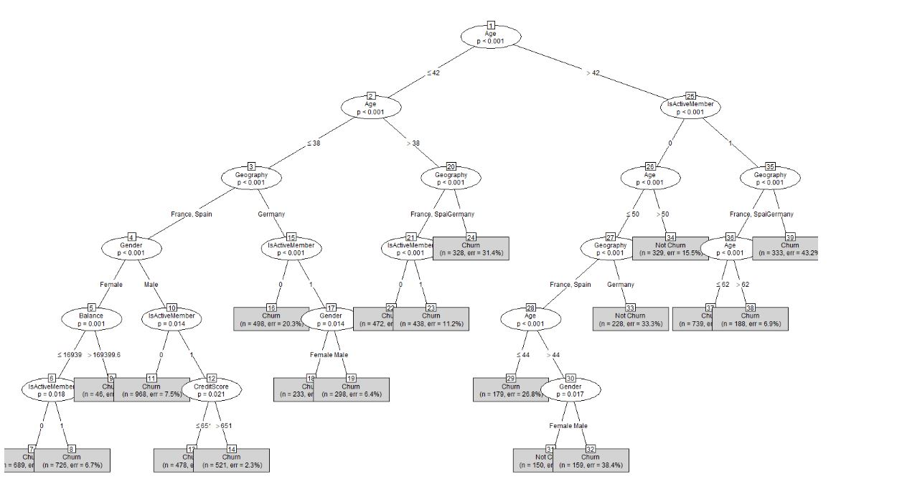

```{r, out.width = "100%", echo = FALSE, fig.align = "center"}

```

```{r setup, include=FALSE}
# clear-up the environment
rm(list = ls())

# chunk options
knitr::opts_chunk$set(
  message = FALSE,
  warning = FALSE,
  fig.align = "center",
  comment = "#>"
)
options(scipen = 9999)

```

# Objective

I am going to make bank churn prediction. It is the dataset of a U.S. bank customer for getting the information, this particular customer will leave bank or not. This dataset is from U.S. bank, given like Credit Score, Age, Gender, and many more.

# Preparation

First, call library we need

```{r}
library(dplyr)
library(tidyverse)
library(gmodels)
library(gtools)
library(class)
```

Library to handle imbalance data

```{r}
library(caret)
```

## Data import

I use dataset from Kaggle. It's called "Bank Customer Churn Prediction". Or you can download from [here](https://www.kaggle.com/datasets/shantanudhakadd/bank-customer-churn-prediction).

```{r}
churn <- read.csv('Churn_Modelling.csv')
glimpse(churn)
```

Important things from data :

1.  `RowNumber` : Row Number Of dataset
2.  `CustomerId` : CustomerID is given
3.  `Surname` : Surname of the customer
4.  `CreditScore`: Credit Score of customer
5.  `Geography` : location of customer
6.  `Gender` : Gender whether male or female
7.  `Age` : Age of the customer
8.  `Tenure` : From how many years customer is in bank
9.  `Balance` : Average balance of customer
10. `NumOfProducts` : Number of bank product facilities customer is using
11. `HasCrCard` : Customer whether has credit card or not
12. `IsActiveMember`: Customer whehter is active member or not
13. `EstimatedSalary` : Customer's estimated salary
14. `Exited` : Customer whether exit or not

Check the data first

```{r}
head(churn)
```

# Data Cleansing

As we can see the data still not clean, the data type is quite not right. Some of the columns are not needed like RowNumber. CustomerId, and Surname.

```{r}
churn_clean <-  churn %>% 
  select(-c(RowNumber, CustomerId, Surname )) %>%
  mutate_if(is.character, as.factor) %>% 
  mutate(
    HasCrCard = as.factor(HasCrCard),
    IsActiveMember = as.factor(IsActiveMember),
    Exited = as.factor(Exited),
    Exited = factor(Exited, levels = c(0, 1),
                    labels = c("Churn",
                               "Not Churn")))

glimpse(churn_clean)
  
```

Check the missing value

```{r}
churn_clean %>% is.na() %>% colSums()
```

The dataset has no missing values. It is okay to continue.

# Pre-Processing Data

Check data proportion from target variable. The target variable or independent varible is `Exited`.

```{r}
churn_clean$Exited %>% table() %>% prop.table
```

It's imbalanced. We are going handle it later.

# Cross Validation

We split the dataset to Train Dataset dan Test Dataset. Train dataset is use to train the model. Test dataset is use to validate our model and see how well our model work to unseen data.

```{r}
# Split the dataset to train data and test data

index <- sample(nrow(churn_clean),
                nrow(churn_clean)*0.8)
churn_train <- churn_clean[index,]
churn_test <- churn_clean[-index,]
```

```{r}
# check proportion table for data train
prop.table(table(churn_train$Exited))
```

Our data is imbalance. So we do downsampling to data train.

```{r}
RNGkind(sample.kind = "Rounding")
set.seed(70)
library(rsample)

churn_train_down <- downSample(
  x = churn_train %>% select(-Exited), 
  y= churn_train$Exited,  
  yname = "Exited"
  ) 

```

Check the propotional of data train after downsampling </br>

```{r}
churn_train_down$Exited %>% table() %>% prop.table()
```
</br>

# Naive Bayes

Positive class : Churn </br> Negative Class : Not Churn

```{r}
library(e1071)
```

```{r}
model_NB_1 <- naiveBayes(
  formula = Exited ~ . , 
  data = churn_train_down
)

model_NB_1
```

```{r}
pred.churn.nb<- predict(
  object = model_NB_1,
  newdata = churn_test,
  type = 'class'
)
```

```{r}
confusionMatrix(
  data = pred.churn.nb,
  reference = churn_test$Exited,
  positive = 'Churn'
)
```
We Cross Check Confusion Matrix and Statistics manually, so we can interpret easier (This step can be skip if you already familiar with the terms)

```{r}

# True Positive
TP = 1213
# False Negative
FN = 386
# False Positive
FP = 136
# True Negative
TN = 265

# Sensitivity
Recall_NB = TP / (TP+FN)
Recall_NB

# Specificity
Specificity_NB = TN / (TN+FP)
Specificity_NB

# Positive Predictive Value
Precision_NB = TP / (TP+FP)
Precision_NB

# Negative Predictive Value
Neg_Pred_Value_NB = TN / (TN+FN)
Neg_Pred_Value_NB
```

## Summary

> based on the Confusion Matrix and Statistics, we get Sensitivity : 0.7586. It is good. This means our model can predict positive class well.


</br>
</br>

# Decision Tree

```{r}
# Load the package

library(partykit)
```

```{r echo = TRUE, fig.width = 28}
# Build tree model
# We already prune the tree so it is not getting complicated

dtree_model1 <- ctree(formula = Exited ~.,
                     data = churn_train,
                     control = ctree_control(mincriterion=0.97,
                                             minsplit=70,
                                             minbucket=30))
# plot(dtree_model1, type = "simple")
```

```{r echo=TRUE, out.width="120%"}

```

```{r}
# Call the model
dtree_model1
```

```{r}
# Prediction with data test
pred_churn_t <- predict(dtree_model1, churn_test, type="response")
```

```{r}
# confusion matrix with data test
confusionMatrix(pred_churn_t, churn_test$Exited, positive = "Churn")
```

## Summary

> based on the Confusion Matrix and Statistics, the model is good. It has Sensitivity : 0.9675. It is close to 1.
> Then it has Specificity : 0.3192. But it is no problem. Because our main concern is positive class (Churn)

# Conclusion

> For this particular Churn Prediction dataset, we can use Decision Tree. Because Decision Tree Model perform better than Naive Bayes Model.
